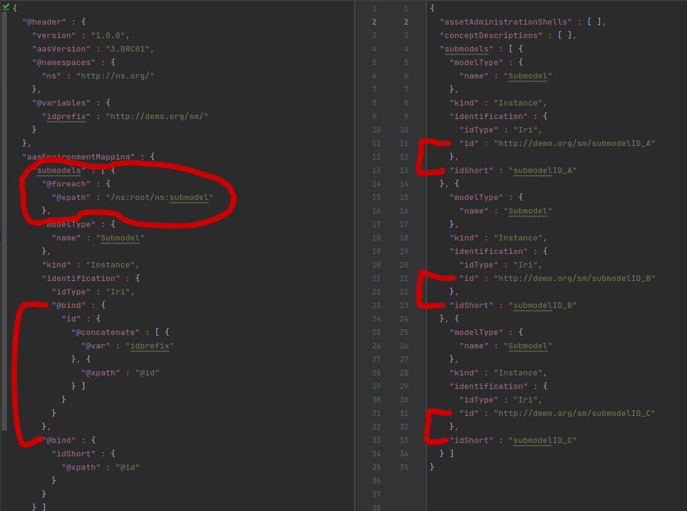
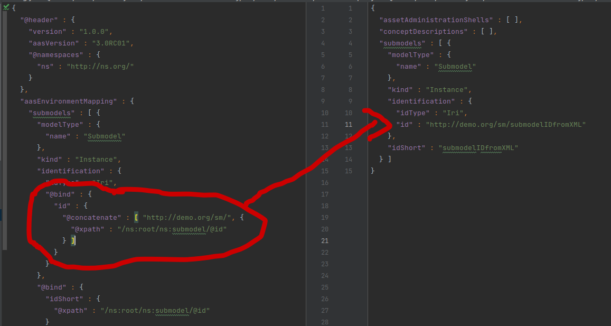
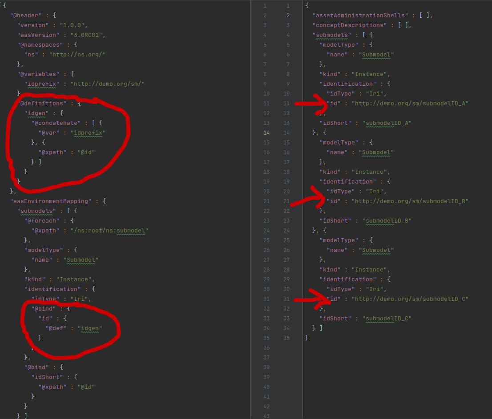
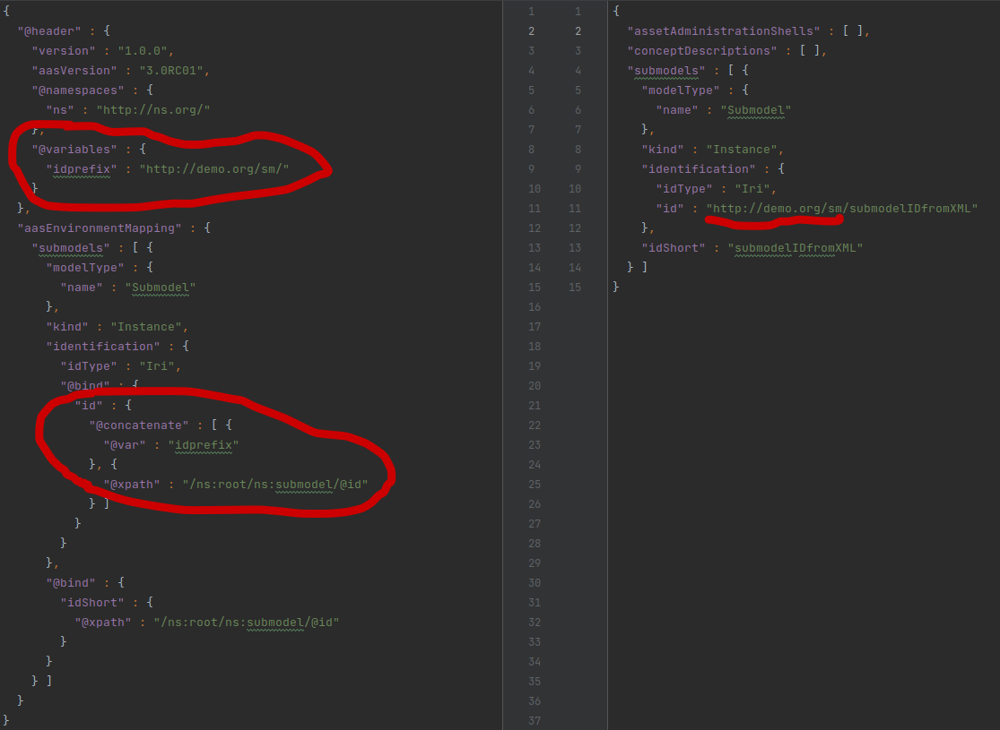
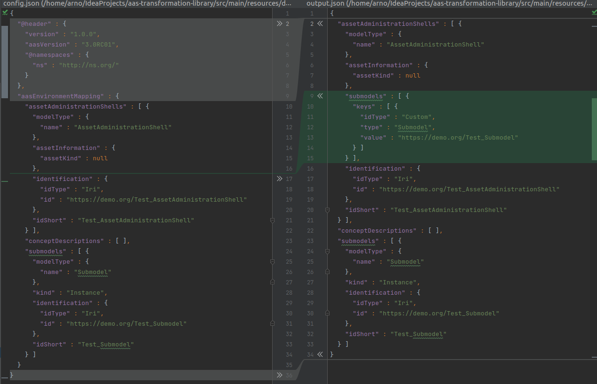

# Configuration

## Basic Structure

Asset Administration Shells are instantiated using a dialect of the [AAS-JSON serialization format](https://github.com/admin-shell-io/aas-specs/tree/feature/JsonUpdate/schemas/json). 
The following json shows the structure of the dialect. The relevance of each section in the header will be explained by 
the individual paragraphs.
```json
{
  "@header": {
    "aasVersion": "3.0RC01",
    "@namespaces": {},
    "@definitions": {},
    "@variables": {},
    "@parameters": {}
  },
  "aasEnvironmentMapping": [
    {
      "assetAdministrationShells": [],
      "assets": [],
      "submodels": [],
      "conceptDescriptions": []
    }
  ]
}
```
Due to this structure, data that is given in the `aasEnvironmentMapping` section can be parsed as AAS directly if no other
concepts are applied. The diff demonstrates this - the header is not in the resulting AAS-JSON but everything else is:


However, this is purely static and does not process any data from the source file.

## Expressions

Expressions are objects denoted by a `@` at the beginning of the json-key and signify a side-effect during
runtime. While those configurations with no expression in their context are just parsed as AAS-JSON, expressions are
evaluated with their result determining the structure of the resulting AAS objects. Examples include:

- `@xpath` for evaluation of xPath-Queries
- `@caexAttributeName` to fetch the attribute name of an element in a AutomationML file. Takes a string.
- `@uaBrowsePath` gets a Node's NodeId by its BrowsePath from a OPC UA nodeset file. Takes a list
  of [BrowseNames](https://reference.opcfoundation.org/Core/docs/Part3/5.2.4/)
  connected by hierarchical ReferenceTypes. This is called the `BrowsePath` in OPC UA.
- `@uaChildren` takes a BrowsePath (see above) and returns all Nodes that are connected to this node via a hierarchical
  ReferenceType.
- Several basic mathematical and boolean operations such as `@plus`,`@times`,`@max`,`@negate` or `@and`.

Please note that Expressions can only be called from within a `@bind`- or `@foreach`-context.

## Looping with `@foreach`

On every level (except for the `aasEnvironmentMapping`) objects can be dynamically generated using this feature. It
evaluates the expression and builds objects according to the statements below - once for every returned value. The
syntax is as follows:

```json
{
  "@foreach": {
    "@xpath": "someXpath"
  },
  "xyz": "abc"
}
```



## Dynamic evaluation with `@bind`

Looping around the results of an expression would be obsolete if all resulting objects would hold the same values.
That's why the @bind Context allows to fill AAS-attributes with the result of an expression. It may only return a single
value that will be used. If I wanted to configure changing idShorts based on the iterator, it could look like this:

```json
{
  "@foreach": {
    "@xpath": "someXpathQuery"
  },
  "@bind": {
    "idShort": {
      "@xpath": "somePotentiallyRelativeXpathQuery"
    }
  }
}
```




## Pre-defined Expressions with `@definitions`

Usually in the `@header` (but everywhere else is fine as well), the config can define more complex functions that will
then be called using the `@def`-key in the `@bind`-context.In the example below, the `exampleFunction` is called to
assign an id to an AAS.

```json
{
  "@headers": {
    "@definitions": {
      "exampleFunction": {
        "@concatenate": [
          {
            "@xpath": "someXpath"
          },
          "/",
          {
            "@xpath": "someOtherXpath"
          }
        ]
      }
    }
  },
  "aasEnvironmentMapping": {
    ...,
    "assetAdministrationShells": {
      "identification": {
        "@bind": {
          "id": {
            "@def": "exampleFunction"
          }
        }
      }
    }
  }
}
```



## Variables and Parameters

Variables and Parameters are very similar in that they allow to reuse a value by binding it to a variable name. They are
initialized in the header in the `@variables` section, can be called by `@var` in the `@bind`-context and updated by 
repeating the `@variables` section in the `aasEnvironmentMapping` section.





Parameters cannot be updated in the config and are not assigned a value in the header. They are given a description and
are set during runtime from the outside. The CLI and the library both allow to pass data setting the parameters that must
however be declared in the config header. They are also called by `@var` in the `@bind` context.

## Auto-Wiring submodels

There are two options to assign a Submodel to a AssetAdministrationShell. The submodel can be passed explicitly as a Reference
as the json-schema demands. If however the configuration leaves the `submodels` list empty in the config-json, all submodels
will be bound to all AssetAdministrationShells. This behaviour differs from the rest of the library as attributs that are not 
given in the config are usually just set to `null`.


