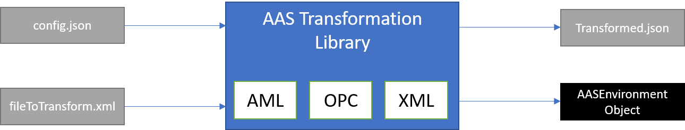

# Introduction

The [AAS Transformation Library](https://github.com/admin-shell-io/aas-transformation-library/) is a software tool that
eases the process of creating Asset Administration Shells from other XML-based formats. This functility is critical to
integrate existing XML-based industry standard in the AAS, most notably OPC UA Nodeset and AutomationML files (.aml, .amlx).
As it builds on open standards, the library is also usable for generic XML-files, however without domain-specific extensions. This library is no
competitor to the OPC UA and AutomationML serializations defined in the specification [Details of the Asset Administration Shell Pt. 1](https://www.plattform-i40.de/IP/Redaktion/EN/Downloads/Publikation/Details_of_the_Asset_Administration_Shell_Part1_V3.html)
as the spec only defines ways to express AAS-native structures in the meta-models of AML or OPC UA. The OPC UA Companion Specification
[OPC UA for Asset Administration Shell](https://reference.opcfoundation.org/I4AAS/docs/) is equivalent to the OPC UA serialization
in the spec.

This library depends heavily on the implementation of the [AAS in java](https://github.com/admin-shell-io/java-model) and the
corresponding [json-deserializer](https://github.com/admin-shell-io/java-serializer/tree/main/dataformat-json).

## Scope

The AAS strives to provide a generic data model for industrial assets. However, depending on the scope, lifecycle stage
and industry, the structure and semantics of a production plants may already be modelled elsewhere. To make use of this
knowledge, users require a semi-automatic way to translate other standards to the AAS. This library can help.

The library can be used twofold. Users can..

1. import the library in Java applications to transform models using the most relevant XML-based industrial standards
   into AAS objects.
2. use the library to build a [fat JAR](https://github.com/johnrengelman/shadow) to transform XML files into AAS JSON
   files locally.

It requires two inputs: The first is the file with the source data and the second is a file that tells the transformation
engine, how to conduct the mapping. When called from the commandline, the resulting AAS will be serialized to json and written to a file.
When used as a dependency in another java-project, it will return an AssetAdministrationShellEnvironment object from the
abovementioned java-model library. The user must decide what transformer to use depending on the format of the source file.

The project was kicked-off by SAP for AutomationML-transformations and extended its scope from there.